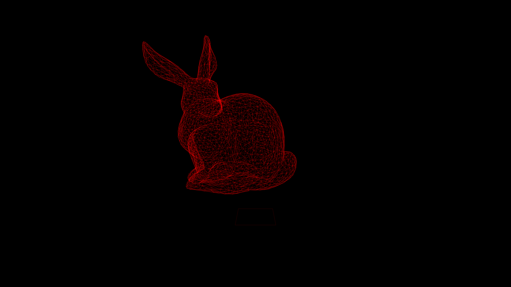

# HTML 5 Toys
Just a collection of small animations and toys I've been playing around with to 
refresh myself with javascript and some graphics concepts.

## Particles and Frames

A refresher on how frames work. Particles that appear inside the left frame are 
replicated in the right frame. The right frame's origin, I, and J vectors can 
be moved around to better demonstrate how they work. For fun, they're turned 
into portals at the bottom.

## Spirographs 

Technically hypotrochoids. Started drawing one to learn how they worked. They're 
so cool that I ended up trying to make a cool animation out of them. Turns out 
three spirographs, lots of linear interpolations, random numbers and pretty colors 
make a really mesmerizing animation!

## 3D Rendering Engine

This was made as an excuse to play with more complicated animations than the 
spirographs. It is capable of reading the basic .obj file format and rendering 
meshes. The renderer is designed similar to basic game engines so that animation 
effects are easy to create and update. Meshes can be rendered in orthographic and 
perspective mode by toggling the camera with 'c'. The camera can be moved with WASD. 

